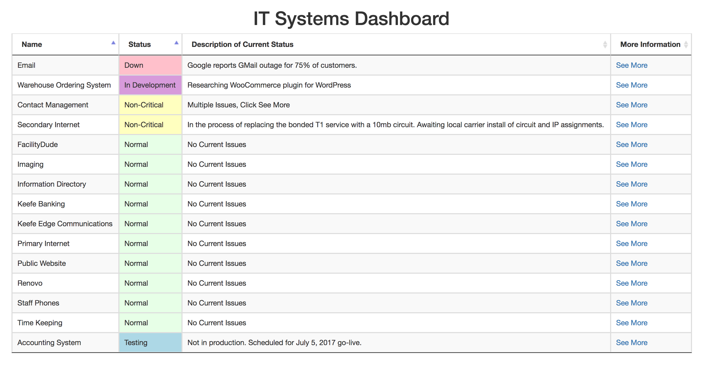
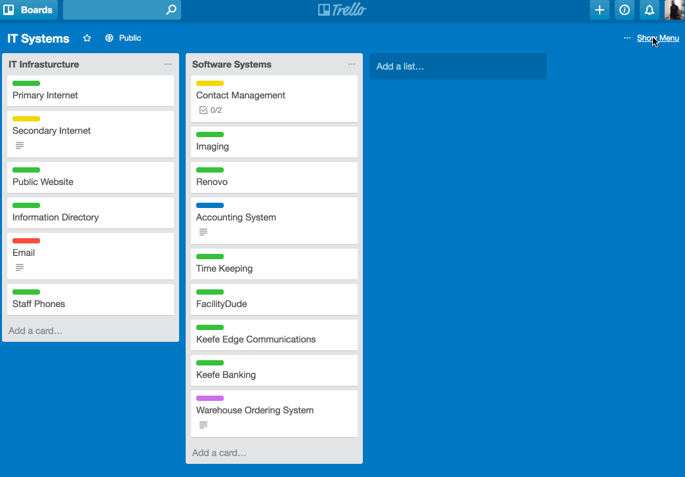

# systems-status

[](https://github.com/RichardLitt/standard-readme)


Systems-Status is a dashboard representation of a Trello board. Using the Trello API, the dashboard shows each card as a row with its name, current status based on the label applied to the card, description, and a link to view more information.



## Table of Contents

- [Background](#background)
- [Install](#install)
- [Usage](#usage)
- [TODO](#todo)
- [Contribute](#contribute)
- [License](#license)

## Background

I was setting up a Trello Board to list all of my IT department's systems after finding [this board](https://trello.com/b/fvcB9sTf/it-services-status-dashboard). I needed a place for management to be able to see in one place all of the systems and services we were responsible for and what, if any, issues we were experiencing to try to keep them from having to remember to ask me between meetings.

While I was familiar with Trello, they were not. This led me to start thinking about a dashboard that could be reviewed quickly, with a way to get to more details if needed. That research led me to the [G Suite Status Dashboard](https://www.google.com/appsstatus#hl=en&v=status).
At first, I thought about scrapping the Trello idea and building the entire dashboard and backend from scratch. However, since I had the Trello board mostly set up, I figured my time was better spent working with what I already had. And, it gave me chance to practice with API programming.

## Install

This project uses a public Trello board as its backend.

1. Create an account at [Trello](https://trello.com) if you don't already have one.

2. Create a new board and make it public.

3. Setup the labels you want to use. For this site, I used "Normal" (green), "Non-Critical" (yellow), "Down" (red), "Testing" (blue), and "In Development" (purple).

4. Add cards for each system you want to track. In my board, I have separate lists for each category (IT Infrastructure and Software Systems) but chose to leave this level of detail out of the dashboard to keep as simple and clean as possible.

5. Deploy the site files to your server.

6. Copy the URL for your board from Trello (see below.)

 

7. In ```config.json```, paste this to the boardURL key.
8. Set your label keys to match the labels you set up in Trello.

## Usage

While I built this as an IT systems dashboard, I'm sure there are other uses that I haven't found yet.

## TODO

* Read labels from Trello board to eliminate hard coding in the ```config.json``` and ```app.js``` files.

* Improve responsiveness on mobile.

## Contribute

PRs accepted.

Small note: If editing the README, please conform to the [standard-readme](https://github.com/RichardLitt/standard-readme) specification.

## License

MIT © Neil Marlowe
